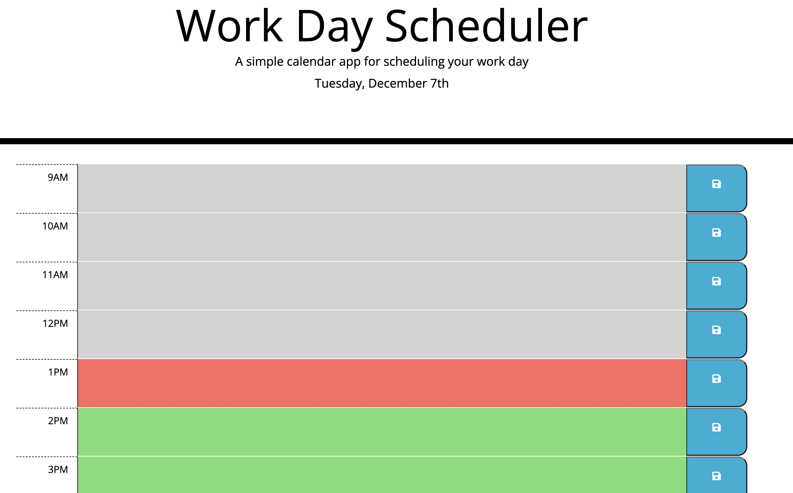

# Work Day Scheduler

This project consists of a calendar application that allows a user to save events for each hour of a working schedule (9 to 5). 

Gray timeblocks indicate that the event belongs to the past.

If there's a red timeblock, it means that the event should be taking place currently.

Green timeblocks indicate upcoming events. 

Site Link: https://abimael1996.github.io/work_day_scheduler/
